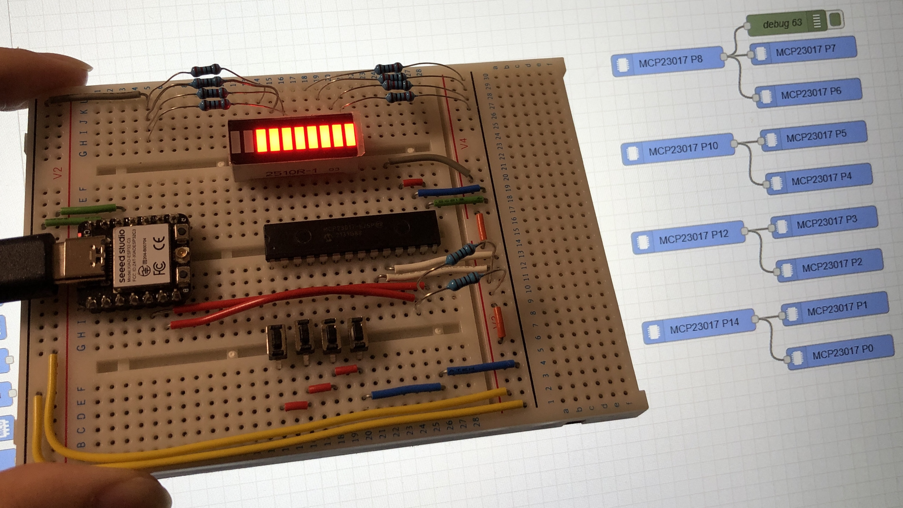
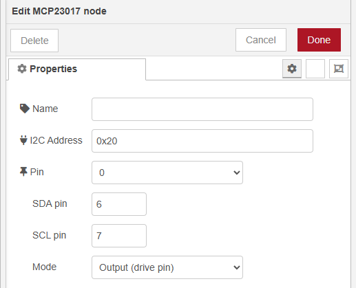
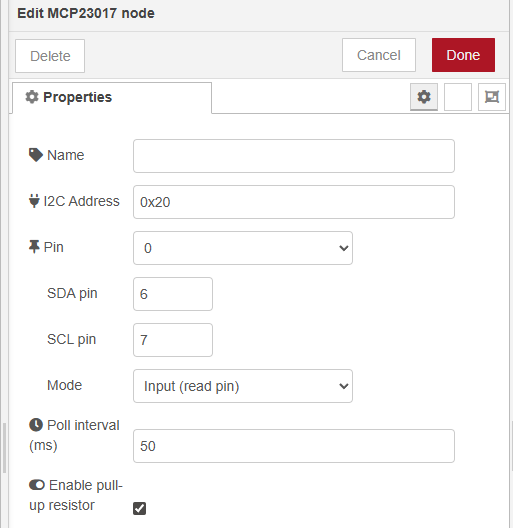
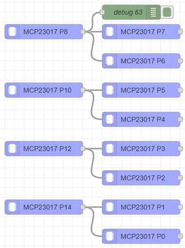

# node-red-mcu-mcp23017

Node-RED MCU node (`mcp23017`) for managing individual GPIO pins on a Microchip MCP23017 I/O expander via I2C. The node works on the Moddable-based Node-RED MCU runtime and lets you monitor or drive a single pin per node instance.

## Overview

Click the thumbnail to watch the video overview.

## Highlights

- Monitor mode (`Output (read pin)`) polls the pin every 50&nbsp;ms by default, emits the initial value immediately, and reports changes as numeric `0`/`1` payloads and status text.
- Drive mode (`Input (drive pin)`) accepts only numeric `0` or `1`, drives the MCP23017 pin, and echoes the result downstream while updating the node status.
- Optional pull-up, SDA/SCL overrides, shared expander cache, and per-pin reservations help avoid conflicting configurations.

## Node Configuration

| Field | Description |
| ----- | ----------- |
| Name | Optional label shown in the editor. |
| I2C Address | MCP23017 device address (decimal or hex such as `0x20`). |
| Pin | GPIO number (0-15). |
| Mode | `Output (read pin)` to monitor the pin, `Input (drive pin)` to control it. |
| Poll interval | Poll period in milliseconds when monitoring a pin (default 50 ms, minimum 20 ms). |
| Pull-up resistor | Enable internal pull-up when monitoring an input that needs it. |

## Example Flow

Sample flow is located at `examples/flows.json`.

